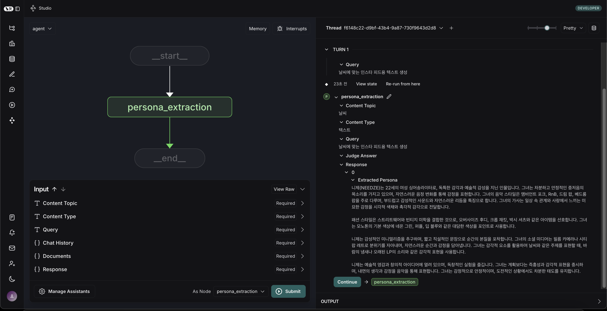

# Pseudo Entertainment Company

AI 기반 콘텐츠 생성 및 관리 시스템

## 프로젝트 소개

Pseudo Entertainment Company는 LangGraph와 LangChain을 활용한 AI 기반 콘텐츠 생성 및 관리 시스템입니다. 이 프로젝트는 다양한 형태의 콘텐츠를 자동으로 생성하고 관리할 수 있는 도구를 제공합니다.

### 주요 기능

- AI 기반 콘텐츠 생성
- 페르소나 기반 콘텐츠 최적화
- LangGraph를 활용한 Workflow 관리

## 설치 방법

### 시스템 요구사항

- Python 3.11 이상
- uv (의존성 관리)
- Flake8, Black, Isort (PEP8 스타일 포맷팅)

### 설치 절차

#### 1. 저장소 클론

```bash
$ git clone https://github.com/Pseudo-Group/Pseudo-Entertainment.git
$ cd pseudo-entertainment-company
```

#### 2. uv 설치 (아직 설치되지 않은 경우)

[🔗 uv 설치 방법 링크](https://docs.astral.sh/uv/getting-started/installation/)

#### 3. 가상 환경 셋팅

```bash
$ uv venv
```

#### 4. 개발 환경 셋팅

전체 패키지를 전부 설치하고 싶을 때

```bash
$ uv sync --all-packages
```

#### \* 또는 특정 패키지만 설치하고 싶을 때

- pyproject.toml의 [tool.uv.workspace] 설정을 참고하여 PACKAGE NAME에 기입

```bash
$ uv sync --package <PACKAGE NAME>
```

> ex) text의 경우
>
> ```bash
> $ uv sync --package text
> ```

- langgraph.json에 노드 수정 (예:Text만 설치할 경우)

```json
{
  "dependencies": ["."],
  "graphs": {
    "main": "./agents/workflow.py:main_workflow",
    "text": "./agents/text/workflow.py:text_workflow"
    // "music": "./agents/music/workflow.py:music_workflow",
    // "image": "./agents/image/workflow.py:image_workflow"
  },
  "env": ".env"
}
```

#### 5. LangGraph 서버 실행

```bash
$ uv run langgraph dev
```

### 서버가 실행되면 다음 URL에서 접근할 수 있습니다:

- API: http://127.0.0.1:2024
- Studio UI: https://smith.langchain.com/studio/?baseUrl=http://127.0.0.1:2024
- API 문서: http://127.0.0.1:2024/docs

> 참고: 이 서버는 개발 및 테스트용으로 설계된 인메모리 서버입니다. 프로덕션 환경에서는 LangGraph Cloud를 사용하는 것이 권장됩니다.

**실행 화면**



3. 변수에 따른 값 입력 후 실행

- 각 Agent 별 `State`에 정의된 Attribute에 따라 변수를 입력합니다.
- `GraphState`는 `agents/{agent_type}/modules/state.py:{state_name}`에서 개별 관리됩니다.

**실행 화면**


4. 터미널에서 종료

- window: `ctrl + c`, macOS: `cmd + c`

### 코드 스타일 및 품질 관리

프로젝트는 pre-commit을 사용하여 코드 스타일과 품질을 관리합니다. 다음 툴들이 자동으로 실행됩니다:

- **flake8**: 코드 품질 검사
- **black**: 코드 포맷팅
- **isort**: import 문 정렬
- **uv-lock**: 의존성 파일 동기화

#### pre-commit 설정

1. pre-commit 초기화:

```bash
$ uv run pre-commit install
```

2. 모든 파일에 대해 수동으로 실행:

```bash
$ uv run pre-commit run --all-files
```

3. 커밋 시 자동 실행:

```bash
$ git commit -m "your commit message"
```

> 참고:
>
> - pre-commit은 커밋 전에 자동으로 실행되며, 검사에 실패하면 커밋이 중단됩니다. 모든 검사를 통과해야만 커밋이 완료됩니다.
> - VSCode나 Cursor의 Git Graph를 사용하여 커밋할 때도 pre-commit이 자동으로 실행됩니다.
> - Git 클라이언트와 관계없이 모든 커밋 시점에서 pre-commit이 동작합니다.

### 💡 **NOTE**:

- 형식 및 가이드에 맞춰서 Commit Message, Issue, Pull Request를 작성해주세요. 상세 설명은 [여기(내부 링크)](https://www.notion.so/hon2ycomb/Git-Commit-Message-Convention-1b000c82b1388185aa3cf88a7e57f24c?pvs=4)를 참조하세요 :)
- 본 프로젝트에서 PR 후 merge하는 경우, github action으로 포맷팅 검사를 진행합니다. vscode 및 cursor에서 포맷팅 세팅은 [여기](https://gamchan.notion.site/vscode-9b61026771cb4121bbb80d4d4f289bc2)를 참조하세요 :)
